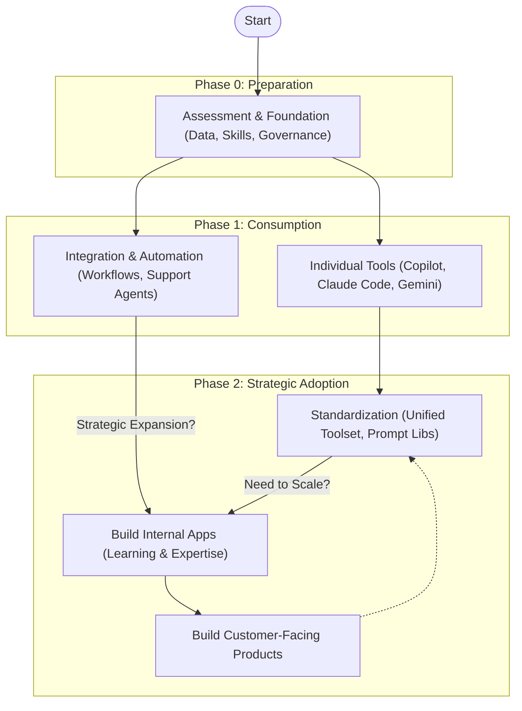

# Learning Materials

This directory contains modular learning materials for building production-ready AI applications with Pydantic AI Framework.

## Introduction

### Who is this for?

Developers and teams who are moving into standardization and strategic adoption of AI technologies within their organizations.

> **Note:** This is not an introductory tutorial for beginners. It assumes familiarity with AI concepts and certain programming skills.

> **Final Note:** If you feel a little bit late to join AI adoption, you're wrong, it's just the right time as we finally have great tools and frameworks to build upon!

### AI Adoption Journey

Organizations typically progress through several stages in their AI adoption:

1. **Assessment & Foundation**: Ensuring data readiness, establishing governance, and upskilling teams before scaling.
2. **Ready-made Tools**: Leveraging existing solutions like GitHub Copilot and Gemini for immediate productivity gains.
3. **Integration & Automation**: Embedding AI into existing workflows (e.g., support agents like Kappa AI) and setting up automations.
4. **Standardization & Internal Development**: Consolidating usage to supported tools, developing shared prompt libraries, and building internal applications to cultivate expertise.
5. **Customer-Facing Products**: Leveraging acquired expertise and standardized practices to build proprietary, customer-facing AI products.

> **Note:** This journey is rarely linear; organizations often cycle back to refine foundations or re-evaluate tools based on performance metrics and evolving regulations.

Not every organization proceeds to the build phases; some may find ready-made tools and integrations sufficient for their needs.



## Structure

The canonical directory layout and module structure for `learning/` is maintained by the [learning-structure skill](.github/skills/learning-structure). Use the skill's script to create, validate, or manage modules.

For the canonical structure definition, see [learning-structure references](.github/skills/learning-structure/references/structure.md).

## How to Use

### For Learners

1. Start with `01-fundamentals` and progress sequentially
2. Each module contains:
   - Concept explanations (markdown files)
   - Practical exercises with sample code
   - References to working examples in `/projects`
3. Complete exercises before moving to the next module
4. Use the `/projects` directory to experiment and build

### For Content Creators

To add or modify modules, use the `learning-structure` skill:

1. Run the script to create a new module:
   ```bash
   python .github/skills/learning-structure/scripts/init_learning_structure.py --add-module XX-module-name --title "Module Title"
   ```
2. Add content to markdown files following these guidelines:
   - **Progressive Complexity**: Build on previous modules
   - **Self-Contained**: Each topic should be independently understandable
   - **Practical Focus**: Include code examples and real-world scenarios
   - **Clear Objectives**: Start modules with learning goals
   - **Exercises**: Provide hands-on practice

For detailed structure, templates, and standards, see the [learning-structure skill documentation](.github/skills/learning-structure/references/structure.md).

## Module Overview

### 01-fundamentals
Introduction to Pydantic AI, environment setup, and basic concepts.

**Learning Objectives:**
- Understand what Pydantic AI is and its use cases
- Set up development environment
- Create your first AI agent

### 02-core-concepts
Deep dive into Pydantic AI core concepts and components.

**Learning Objectives:**
- Understand agents, models, and tools
- Work with structured outputs using Pydantic models
- Implement tool calling and function execution

### 03-advanced-patterns
Advanced implementation patterns for production applications.

**Learning Objectives:**
- Implement streaming responses
- Handle errors and retries gracefully
- Build complex multi-agent systems

### 04-production-deployment
Production deployment, monitoring, and scaling strategies.

**Learning Objectives:**
- Monitor AI applications in production
- Scale AI workloads efficiently
- Implement security best practices

## Contributing

Content creators are encouraged to:
1. Follow the modular structure
2. Maintain consistency in formatting and style
3. Test all code examples
4. Provide clear learning paths
5. Update this README when adding new modules

## Resources

- [Learning Materials](MATERIALS.md) - Curated books, websites, and videos for AI application development
- [Pydantic AI Documentation](https://ai.pydantic.dev/)
- [Pydantic Documentation](https://docs.pydantic.dev/)
- Project examples in `/projects`
