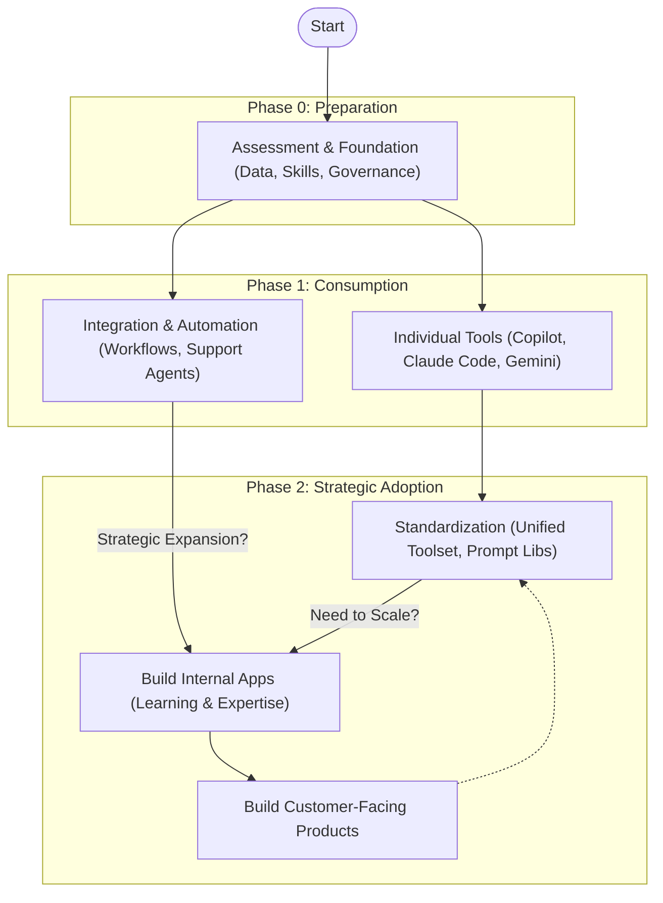

# Learning Roadmap

This directory contains modular learning materials for building production-ready AI applications with Pydantic AI Framework.

## Introduction

### Who is this for?

Developers and teams who are moving into standardization and strategic adoption of AI technologies within their organizations.

> **Note:** This is not an introductory tutorial for beginners. It assumes familiarity with AI concepts and certain programming skills.
> **Final Note:** If you feel a little bit late to join AI adoption, you're wrong, it's just the right time as we finally have great tools and frameworks to build upon!

## Scope

### In Scope

The learning path focuses on the pieces of the AI engineering puzzle that are essential for
building, operating, and scaling **production‑ready agents** with the
Pydantic AI framework. Topics you will encounter include:

- Agent design and decomposition patterns (plan‑execute‑reflect loops, tool
  orchestration, sub‑agents) and how to structure code for clarity and reuse.
- Declarative, type‑safe prompts and **structured output validation** using
  Pydantic models.
- Practical security practices: OWASP‑inspired LLM risks, prompt‑injection
  defenses, least‑privilege tooling, sandboxing, and human‑in‑the‑loop
  approvals (see the cheat sheet and concepts pages).
- Observability and monitoring: instrumenting agents with Logfire/OTel,
  tracing, error/span analysis, and defining meaningful business and model
  metrics (goodput, TTFT, drift signals).
- Retrieval‑augmented generation (RAG) pipelines, context chunking, hybrid
  search, and faithfulness/precision evaluation strategies.
- Evaluation methodologies: deterministic validators, span‑based checks,
  LLM‑as‑judge, and using Pydantic Evals to codify quality thresholds.
- Scalability considerations: caching, routers/gateways, parallel execution
  graphs, and strategies for low latency and cost efficiency.
- Enterprise‑grade concerns such as data governance, ROI gap, and operational
  maturity (see AI adoption journey in the cheat sheet).
- Hands‑on exercises, starter code, and the reference `course‑navigator`
  agent for indexing and querying course material.

### Out of Scope

- Training or fine‑tuning large language models, or any deep‑learning model
  development beyond using hosted inference APIs.
- Advanced MLOps, data‑engineering pipelines, or complex production infrastructure (beyond simple illustrative examples in `packages/`).
- Languages or platforms other than Python; all code examples assume Python
  3.12+ and the `pydantic-ai` ecosystem.
- General AI/ML theory not directly tied to agent development and the
  Pydantic AI stack.
- Commercial product road‑maps, proprietary business logic, or
  organization‑specific policies.

### AI Adoption Journey

Organizations typically progress through several stages in their AI adoption:

1. **Assessment & Foundation**: Ensuring data readiness, establishing governance, and upskilling teams before scaling.
2. **Ready-made Tools**: Leveraging existing solutions like GitHub Copilot and Gemini for immediate productivity gains.
3. **Integration & Automation**: Embedding AI into existing workflows (e.g., support agents like Kappa AI) and setting up automations.
4. **Standardization & Internal Development**: Consolidating usage to supported tools, developing shared prompt libraries, and building internal applications to cultivate expertise.
5. **Customer-Facing Products**: Leveraging acquired expertise and standardized practices to build proprietary, customer-facing AI products.

> **Note:** This journey is rarely linear; organizations often cycle back to refine foundations or re-evaluate tools based on performance metrics and evolving regulations.

Not every organization proceeds to the build phases; some may find ready-made tools and integrations sufficient for their needs.


```mermaid
graph TD
    A(["Start"])
    Z["Assessment & Foundation (Data, Skills, Governance)"]
    B["Individual Tools (Copilot, Claude Code, Gemini)"]
    C["Integration & Automation (Workflows, Support Agents)"]
    F["Standardization (Unified Toolset, Prompt Libs)"]
    G["Build Internal Apps (Learning & Expertise)"]
    H["Build Customer-Facing Products"]

    A --> Z
    Z --> B
    Z --> C
    B --> F
    C -- Strategic Expansion? --> G
    F -- Need to Scale? --> G
    G --> H
    H -.-> F

    subgraph Phase0 ["Phase 0: Preparation"]
        Z
    end

    subgraph Phase1 ["Phase 1: Consumption"]
        B
        C
    end

    subgraph Phase2 ["Phase 2: Strategic Adoption"]
        F
        G
        H
    end
```

## How to Use

### For Learners

1. Start with `01-fundamentals` and progress sequentially
2. Each module includes concept explanations, practical exercises with sample code, and references to working examples in `/packages`.
3. Complete exercises before moving to the next module
4. Use the `/packages` directory to experiment and build

### For Content Creators

To add or modify modules, use the monorepo script and instruction modules:

1. Run the script to create a new module:

   ```bash
    python scripts/learning/init_learning_structure.py --add-module XX-module-name --title "Module Title"
   ```

2. Add content to markdown files following these guidelines:
   - **Progressive Complexity**: Build on previous modules
   - **Self-Contained**: Each topic should be independently understandable
   - **Practical Focus**: Include code examples and real-world scenarios
   - **Clear Objectives**: Start modules with learning goals
   - **Exercises**: Provide hands-on practice

For detailed structure and standards, see:

- [../.github/instructions/learning-operations.instructions.md](../.github/instructions/learning-operations.instructions.md)
- [../.github/instructions/monorepo.instructions.md](../.github/instructions/monorepo.instructions.md)

## Module Overview

### 01-fundamentals

Introduction to Pydantic AI, environment setup, and basic concepts.

**Learning Objectives:**

- Understand what Pydantic AI is and its use cases
- Set up development environment
- Create your first AI agent

## Contributing

Content creators are encouraged to:

1. Follow the modular structure
2. Maintain consistency in formatting and style
3. Test all code examples
4. Provide clear learning paths
5. Update this README when adding new modules

## Resources

- [Learning Materials](MATERIALS.md) - Curated books, websites, and videos for AI application development
- [Pydantic AI Documentation](https://ai.pydantic.dev/)
- [Pydantic Documentation](https://docs.pydantic.dev/)
- Project examples in `/packages`
